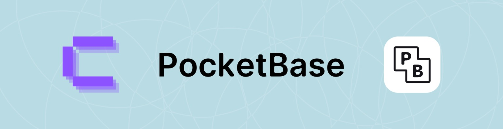

# PocketBase at Coolify

> [Coolify](https://github.com/coollabsio/coolify) x [Pocketbase](https://pocketbase.io/) releases to AMD & ARM architectures.

Full open source with backups for your database at your server [Coolify](https://coolify.io)! 🚀

    

    
    
    

Since v0.31.0 the release process is automated. It runs every day at midnight.

    <h2 style="width: 100%;">Contributors (10)</h2>
    
    
    
    
    
    
    
    
    
    

